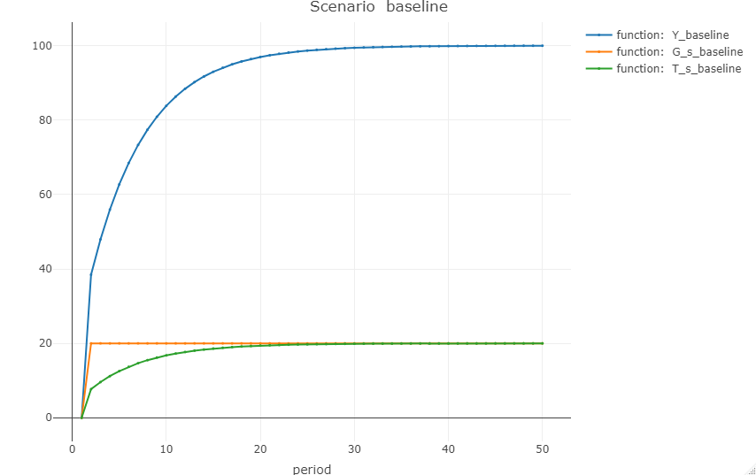
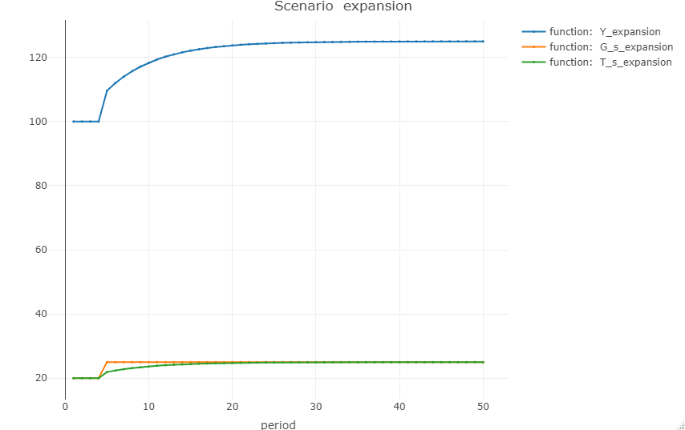
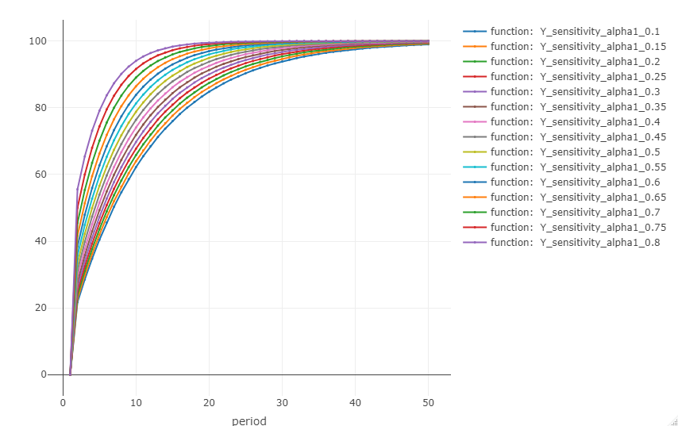

# godley
```godley``` is an R package for simulating SFC (stock-flow consistent) models. It can be used to create and simulate fully fledged post-keynesian / MMT models of the economy. It allows users to apply shocks, simulate effects of changing parameters, visualize different macro scenarios and much more. ```godley``` is named after Wynne Godley (1926-2010).

## Installation
The best way to start using ```godley``` is to install it directly grom GitHub using the ```devtools``` package. 

``` r
install.packages("devtools")
devtools::install_github("gamrot/godley")
```

## Usage
Below you can find a simple example of ```godley``` in action. Let's play with the well known "SIM model" from Monetary Economics (Godley & Lavoie, 2007).

First, we need to create an empty model using ```create_model()``` function.

``` r
model_sim <- create_model(name = "SFC SIM")
```

Now let's add some variables using the ```add_variable()``` function. This will add a ```$varibles``` tibble to the model.

``` r
model_sim <- model_sim |>
  add_variable("C_d", desc = "Consumption demand by households") |>
  add_variable("C_s", desc = "Consumption supply") |>
  add_variable("G_s", desc = "Government supply") |>
  add_variable("H_h", desc = "Cash money held by households") |>
  add_variable("H_s", desc = "Cash money supplied by the government") |>
  add_variable("N_d", desc = "Demand for labor") |>
  add_variable("N_s", desc = "Supply of labor") |>
  add_variable("T_d", desc = "Taxes, demand") |>
  add_variable("T_s", desc = "Taxes, supply") |>
  add_variable("Y", desc = "Income = GDP") |>
  add_variable("Yd", desc = "Disposable income of households") |>
  add_variable("alpha1", init = 0.6, desc = "Propensity to consume out of income") |>
  add_variable("alpha2", init = 0.4, desc = "Propensity to consume out of wealth") |>
  add_variable("theta", init = 0.2, desc = "Tax rate") |>
  add_variable("G_d", init = 20, desc = "Government demand") |>
  add_variable("W", init = 1, desc = "Wage rate")

model_sim$variables

## # A tibble: 16 x 3
##    name   desc                                   init
##    <chr>  <chr>                                 <dbl>
##  1 C_d    Consumption demand by households        0  
##  2 C_s    Consumption supply                      0  
##  3 G_s    Government supply                       0  
##  4 H_h    Cash money held by households           0  
##  5 H_s    Cash money supplied by the government   0  
##  6 N_d    Demand for labor                        0  
##  7 N_s    Supply of labor                         0  
##  8 T_d    Taxes, demand                           0  
##  9 T_s    Taxes, supply                           0  
## 10 Y      Income = GDP                            0  
## 11 Yd     Disposable income of households         0  
## 12 alpha1 Propensity to consume out of income     0.6
## 13 alpha2 Propensity to consume out of wealth     0.4
## 14 theta  Tax rate                                0.2
## 15 G_d    Government demand                      20  
## 16 W      Wage rate                               1
```

Okay, let's add some equations, shall we? There's a function for that! You've guessed it, it's the ```add_equation()``` function. It also adds a tibble to the model, this time it's called ```$equation```

``` r
model_sim <- model_sim |>
  add_equation("C_s = C_d", desc = "Consumption") |>
  add_equation("G_s = G_d") |>
  add_equation("T_s = T_d") |>
  add_equation("N_s = N_d") |>
  add_equation("Yd = W * N_s - T_s") |>
  add_equation("T_d = theta * W * N_s") |>
  add_equation("C_d = alpha1 * Yd + alpha2 * H_h[-1]") |>
  add_equation("H_s = G_d - T_d + H_s[-1]") |>
  add_equation("H_h = Yd - C_d + H_h[-1]") |>
  add_equation("Y = C_s + G_s") |>
  add_equation("N_d = Y/W") |>
  add_equation("H_s = H_h", desc = "Money equilibrium", hidden = TRUE)
  
model_sim$equation

## # A tibble: 12 x 3
##    equation                             desc                hidden
##    <chr>                                <chr>               <lgl> 
##  1 C_s = C_d                            "Consumption"       FALSE 
##  2 G_s = G_d                            ""                  FALSE 
##  3 T_s = T_d                            ""                  FALSE 
##  4 N_s = N_d                            ""                  FALSE 
##  5 Yd = W * N_s - T_s                   ""                  FALSE 
##  6 T_d = theta * W * N_s                ""                  FALSE 
##  7 C_d = alpha1 * Yd + alpha2 * H_h[-1] ""                  FALSE 
##  8 H_s = G_d - T_d + H_s[-1]            ""                  FALSE 
##  9 H_h = Yd - C_d + H_h[-1]             ""                  FALSE 
## 10 Y = C_s + G_s                        ""                  FALSE 
## 11 N_d = Y/W                            ""                  FALSE 
## 12 H_s = H_h                            "Money equilibrium" TRUE
```

With all variables and equations defined, it's about time to run some simulations using the ```simulate_scenario()``` function. You can choose simulation method (```Newton``` or ```Gauss```) and number of periods (think quarters or years). Results will be stored in a ```$result``` tibble under a ```$baseline``` scenario.

``` r
model_sim <- simulate_scenario(model = model_sim, scenario = "baseline", max_iter = 350, 
                               periods = 100, hidden_tol = 0.1, tol = 1e-08, method = "Newton")

model_sim$baseline$result

## # A tibble: 100 x 16
##      C_s   G_s   T_s   N_s    Yd   T_d   C_d   H_s   H_h     Y   N_d alpha1
##    <dbl> <dbl> <dbl> <dbl> <dbl> <dbl> <dbl> <dbl> <dbl> <dbl> <dbl>  <dbl>
##  1   0       0  0      0     0    0      0     0     0     0     0      0.5
##  2  13.3    20  6.67  33.3  26.7  6.67  13.3  13.3  13.3  33.3  33.3    0.5
##  3  22.2    20  8.44  42.2  33.8  8.44  22.2  24.9  24.9  42.2  42.2    0.5
##  4  29.9    20  9.99  49.9  39.9  9.99  29.9  34.9  34.9  49.9  49.9    0.5
##  5  36.6    20 11.3   56.6  45.3 11.3   36.6  43.6  43.6  56.6  56.6    0.5
##  6  42.4    20 12.5   62.4  49.9 12.5   42.4  51.1  51.1  62.4  62.4    0.5
##  7  47.4    20 13.5   67.4  53.9 13.5   47.4  57.6  57.6  67.4  67.4    0.5
##  8  51.7    20 14.3   71.7  57.4 14.3   51.7  63.3  63.3  71.7  71.7    0.5
##  9  55.5    20 15.1   75.5  60.4 15.1   55.5  68.2  68.2  75.5  75.5    0.5
## 10  58.8    20 15.8   78.8  63.0 15.8   58.8  72.4  72.4  78.8  78.8    0.5
## # ... with 90 more rows, and 4 more variables: alpha2 <dbl>, theta <dbl>,
## #   G_d <dbl>, W <dbl>
```

When everything is done, you can plot the results using the ```plot_simulation()``` function. You can define which variables or expressions you want. Let's plot Income, Government spending and Taxes.

``` r
plot_simulation(model = model_sim, scenario = "baseline", from = 1, to = 50, 
                expressions = c("Y", "G_s", "T_s"))
```



And one more thing (if you're lazy like me), you can create models using "templates" using ```create_model(template = "SIM")```. You can choose from ```SIM```, ```PC```, ```LP```, ```REG```, ```OPEN```, ```BMW```, ```BMWK```, ```DIS```, ```DISINF``` and ```SIMEX```. Basically all models from Godley & Lavoie (2007). 

### Shocks
```godley``` allows you to create and simulate shocks. Let's see what happens if we increase government spending.

To create the shock first we need to create an empty shock object with a ```create_shock()```. Next let's see what's gonna happen when we use the ```add_shock()``` function to increase government spending by 5 units from 5th to 50th period.

``` r
sim_shock <- create_shock() 

sim_shock <- add_shock(shock = sim_shock, equation = "G_d = 25", 
		       desc = "permanent increase in government expenditures", start = 5, end = 50)

sim_shock

## # A tibble: 1 x 4
##   equation desc                                          start   end
##   <chr>    <chr>                                         <dbl> <dbl>
## 1 G_d = 25 permanent increase in government expenditures     5    50
```

With everything defined, let's add a new scenario using the ```add_scenario()``` function. But first we need to instrcut ```godley``` which scenario we will use as a starting point (and which period).

``` r
model_sim <- add_scenario(model = model_sim, name = "expansion", origin = "baseline", 
			  origin_period = 100, shock = sim_shock)
```

After a shock scenario is created we can simulate it using the now familiar ```simulate_scenario()``` function.

``` r
model_sim <- simulate_scenario(model = model_sim, max_iter = 350, periods = 100, 
			       hidden_tol = 0.1, tol = 1e-08, method = "Newton")

model_sim$expansion$result

## # A tibble: 100 x 16
##      C_s   G_s   T_s   N_s    Yd   T_d   C_d   H_s   H_h     Y   N_d alpha1
##    <dbl> <dbl> <dbl> <dbl> <dbl> <dbl> <dbl> <dbl> <dbl> <dbl> <dbl>  <dbl>
##  1   0       0  0      0     0    0      0     0     0     0     0      0.5
##  2  13.3    20  6.67  33.3  26.7  6.67  13.3  13.3  13.3  33.3  33.3    0.5
##  3  22.2    20  8.44  42.2  33.8  8.44  22.2  24.9  24.9  42.2  42.2    0.5
##  4  29.9    20  9.99  49.9  39.9  9.99  29.9  34.9  34.9  49.9  49.9    0.5
##  5  39.9    25 13.0   64.9  51.9 13.0   39.9  46.9  46.9  64.9  64.9    0.5
##  6  47.9    25 14.6   72.9  58.4 14.6   47.9  57.3  57.3  72.9  72.9    0.5
##  7  54.9    25 16.0   79.9  63.9 16.0   54.9  66.4  66.4  79.9  79.9    0.5
##  8  60.9    25 17.2   85.9  68.7 17.2   60.9  74.2  74.2  85.9  85.9    0.5
##  9  66.1    25 18.2   91.1  72.9 18.2   66.1  80.9  80.9  91.1  91.1    0.5
## 10  70.6    25 19.1   95.6  76.5 19.1   70.6  86.8  86.8  95.6  95.6    0.5
## # ... with 90 more rows, and 4 more variables: alpha2 <dbl>, theta <dbl>,
## #   G_d <dbl>, W <dbl>
```

Now let's see the results using the ```plot_simulation()``` function. As you can see, an increase in government expenditures has a positive effect on income... And not so positive short-term effect on government ballance.

``` r
plot_simulation(model = model_sim, scenario = c("expansion"), from = 1, to = 50, 
                expressions = c("Y", "G_s", "T_s"))
```


### Sensitivity
```godley``` allows users to see if simulation results are sensitive to parameter changes. After all, we don't want to create models that make sense just for a specific combination of parameters. Let's see how small changes to *alpha1* affect short-term model dynamics.

First we need to create a new object using ```create_sensitivity()``` function and define lower and upper bounds for the parameter we want analyze.

``` r
model_sens <- create_sensitivity(model_pass = model_sim, variable = "alpha1", 
				 lower = 0.1, upper = 0.7, step = 0.05)
```

Now we're ready to simulate results and see it on a plot

``` r
model_sens <- simulate_scenario(model = model_sens, max_iter = 350, periods = 100, 
                                hidden_tol = 0.1, tol = 1e-08, method = "Newton")

plot_simulation(model = model_sens, scenario = "sensitivity", take_all = TRUE, 
		            from = 1, to = 50, expressions = c("Y"))
```



## Functions
Here's a list of package's most important fucntions.

```create_model()``` - creates an SFC model \
```add_variable()``` - adds a variable \
```add_equation()``` - adds an equation \
```simulate_scenario()``` - simulates a selected scenario(s) \
```plot_simulation()``` - plots simulation results

```create_shock()``` - creates an ```SFC_shock``` object \
```add_shock()``` - adds shock equations \
```add_scenario()``` - adds scenario to an existing model \

```create_sensitivity()``` - creates a new SFC model with sensitivity scenarios for selected parameters. 

## Similar work
There are two other packages that also allows users to build stock-flow consistent models: 

- `sfcr` (https://github.com/joaomacalos/sfcr), you should definitely check it out!
- `pysolve3` (https://github.com/gpetrini/pysolve3)

## Getting help

If you encounter a clear bug, please file an issue with a minimal reproducible example on [GitHub](https://github.com/gamrot/godley/issues).
