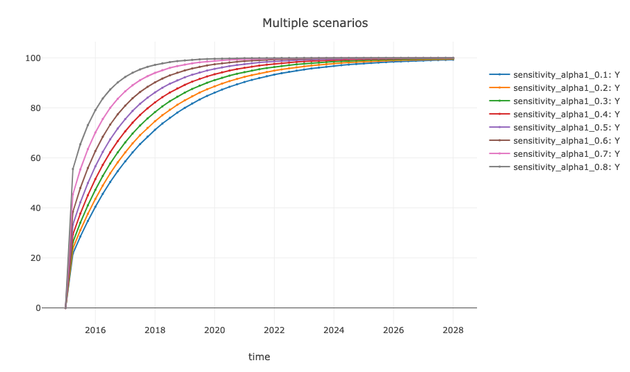

# godley

`godley` is an R package for simulating stock-flow consistent (SFC) macroeconomic models.

By employing godley, users can create fully fledged post-keynesian and MMT models of the economy to:

- analyze parameter changes,
- impose policy or exogenous shocks,
- visualize dynamic scenarios, and
- study the implications of various macroeconomic structures on key variables.

The package offers the flexibility to support both theoretical frameworks and data-driven scenarios.

It is named in honor of Wynne Godley (1926–2010), a prominent British post-Keynesian economist and a leading figure in SFC modeling.

### Installation ⚙️

`godley` is currently hosted on GitHub. To install the development version directly, please use `devtools` package:

``` r
install.packages("devtools")
devtools::install_github("gamrot/godley")
```

### Example 📊

Below is a brief illustration of how to set up and simulate a simple SFC model using godley. The example is based on the well-known "SIM" model from Monetary Economics by Godley & Lavoie (2007).

First, define the model structure:

``` r
model_sim <- create_model(name = "SFC SIM")
```

To include variables in your model, use the `add_variable()` function. This function adds a `$variables` tibble to the model. Each variable can be assigned an initial value, either a single scalar (representing a theoretical starting point) or a complete vector of real data.

``` r
model_sim <- model_sim |>
 add_variable("C_d", desc = "Consumption demand by households") |> 
 add_variable("C_s", desc = "Consumption supply") |> 
 add_variable("G_s", desc = "Government supply") |> 
 add_variable("H_h", desc = "Cash money held by households") |> 
 add_variable("H_s", desc = "Cash money supplied by the government") |> 
 add_variable("N_d", desc = "Demand for labor") |> 
 add_variable("N_s", desc = "Supply of labor") |> 
 add_variable("T_d", desc = "Taxes, demand") |> 
 add_variable("T_s", desc = "Taxes, supply") |> 
 add_variable("Y", desc = "Income = GDP") |> 
 add_variable("Yd", desc = "Disposable income of households") |> 
 add_variable("alpha1", init = 0.6, desc = "Propensity to consume out of income") |> 
 add_variable("alpha2", init = 0.4, desc = "Propensity to consume out of wealth") |> 
 add_variable("theta", init = 0.2, desc = "Tax rate") |> 
 add_variable("G_d", init = 20, desc = "Government demand") |> 
 add_variable("W", init = 1, desc = "Wage rate")

model_sim$variables

## # A tibble: 16 × 3
##    name   init      desc
##    <chr>  <list>    <chr>
##  1 C_d    0         Consumption demand by households
##  2 C_s    0         Consumption supply
##  3 G_s    0         Government supply
##  4 H_h    0         Cash money held by households
##  5 H_s    0         Cash money supplied by the government
##  6 N_d    0         Demand for labor
##  7 N_s    0         Supply of labor
##  8 T_d    0         Taxes, demand
##  9 T_s    0         Taxes, supply
## 10 Y      0         Income = GDP
## 11 Yd     0         Disposable income of households
## 12 alpha1 0.6       Propensity to consume out of income
## 13 alpha2 0.4       Propensity to consume out of wealth
## 14 theta  0.2       Tax rate
## 15 G_d    20        Government demand
## 16 W      1         Wage rate
```

Then, specify the system of equations that governs the model. This step is supported by a dedicated function, which appends an `$equations` tibble to the model. Lags can be indicated by `[-1]`, and first differences by `d()`. These can be combined to create more complex expressions; for instance, `d(H_s[-1])` denotes a lagged difference.

``` r
model_sim <- model_sim |>
  add_equation("C_s = C_d", desc = "Consumption") |> 
  add_equation("G_s = G_d") |> 
  add_equation("T_s = T_d") |> 
  add_equation("N_s = N_d") |> 
  add_equation("Yd = W * N_s - T_s") |> 
  add_equation("T_d = theta * W * N_s") |> 
  add_equation("C_d = alpha1 * Yd + alpha2 * H_h[-1]") |> 
  add_equation("H_s = G_d - T_d + H_s[-1]") |> 
  add_equation("H_h = Yd - C_d + H_h[-1]") |> 
  add_equation("Y = C_s + G_s") |> 
  add_equation("N_d = Y/W") |> 
  add_equation("H_s = H_h", desc = "Money equilibrium", hidden = TRUE)

model_sim$equations

## # A tibble: 12 × 3
##    equation                             hidden desc               
##    <chr>                                <lgl>  <chr>              
##  1 C_s = C_d                            FALSE  "Consumption"      
##  2 G_s = G_d                            FALSE  ""                 
##  3 T_s = T_d                            FALSE  ""                 
##  4 N_s = N_d                            FALSE  ""                 
##  5 Yd = W * N_s - T_s                   FALSE  ""                 
##  6 T_d = theta * W * N_s                FALSE  ""                 
##  7 C_d = alpha1 * Yd + alpha2 * H_h[-1] FALSE  ""                 
##  8 H_s = G_d - T_d + H_s[-1]            FALSE  ""                 
##  9 H_h = Yd - C_d + H_h[-1]             FALSE  ""                 
## 10 Y = C_s + G_s                        FALSE  ""                 
## 11 N_d = Y/W                            FALSE  ""                 
## 12 H_s = H_h                            TRUE   "Money equilibrium"
```

With all variables and equations defined, the model is ready to be solved over a given time horizon. This can be done using the `simulate_scenario()` function. The function allows selecting the number of periods, choosing a simulation method (`Newton` or `Gauss`), and optionally specifying a starting quarter date. The simulation results are stored in a `$result` tibble within the `$baseline` scenario.

``` r
model_sim <- model_sim |>
  simulate_scenario(
    periods = 100, start_date = "2015-01-01",
    method = "Gauss", max_iter = 350, tol = 1e-05
  )

model_sim$baseline$result

## # A tibble: 100 × 17
##    time         C_s   G_s   T_s   N_s    Yd   T_d   C_d   H_s   H_h     Y   N_d
##    <date>     <dbl> <dbl> <dbl> <dbl> <dbl> <dbl> <dbl> <dbl> <dbl> <dbl> <dbl>
##  1 2015-01-01   0       0  0      0     0    0      0     0     0     0     0  
##  2 2015-04-01  18.5    20  7.69  38.5  30.8  7.69  18.5  12.3  12.3  38.5  38.5
##  3 2015-07-01  27.9    20  9.59  47.9  38.3  9.59  27.9  22.7  22.7  47.9  47.9
##  4 2015-10-01  35.9    20 11.2   55.9  44.8 11.2   35.9  31.5  31.5  55.9  55.9
##  5 2016-01-01  42.7    20 12.5   62.7  50.2 12.5   42.7  39.0  39.0  62.7  62.7
##  6 2016-04-01  48.5    20 13.7   68.5  54.8 13.7   48.5  45.3  45.3  68.5  68.5
##  7 2016-07-01  53.3    20 14.7   73.3  58.6 14.7   53.3  50.6  50.6  73.3  73.3
##  8 2016-10-01  57.4    20 15.5   77.4  61.9 15.5   57.4  55.2  55.2  77.4  77.4
##  9 2017-01-01  60.9    20 16.2   80.9  64.7 16.2   60.9  59.0  59.0  80.9  80.9
## 10 2017-04-01  63.8    20 16.8   83.8  67.1 16.8   63.8  62.2  62.2  83.8  83.8
## # … with 90 more rows, and 5 more variables: alpha1 <dbl>, alpha2 <dbl>,
## #   theta <dbl>, G_d <dbl>, W <dbl>
```

### Visualizations 🎨

**godley** provides support for customized visualizations.\
Simulation outcomes can be plotted using the `plot_simulation()` function, where users can specify the variables or expressions of interest. In the example below, the plot displays Income, Government spending, and Taxes expressions.  

``` r
plot_simulation(
  model_sim, scenario = "baseline",
  from = "2015-01-01", to = "2023-01-01",
  expressions = c("Y", "G_s", "T_s")
)
```


In addition to plotting variables over time, the `plot_cycles()` function can be used to visualize the model structure and identify loops in the interdependencies between variables.

``` r
plot_cycles(model_sim)
```


### Templates 📝
**godley** includes predefined templates to streamline model creation. These templates are accessible through `create_model(template = "SIM")`. Available templates include `SIM`, `SIMEX`, `PC`, `PCEX`, `LP`, `REG`, `OPEN`, `BMW`, `BMWK`, `DIS`, and `DISINF` -- covering all models presented in Godley & Lavoie (2007).

### Shocks ⚡

The package supports the introduction and simulation of shocks within the model.

For instance, an increase in government spending can be simulated by first creating a shock object with `create_shock()` and then applying `add_shock()` to introduce a 20% increase in government spending between Q1 2017 and Q4 2020. 

Shock values can be defined explicitly (`value`), as a relative rate (`rate`), or as an absolute increment (`absolute`):

``` r
sim_shock <- create_shock() |>
  add_shock(
    variable = "G_d", rate = 0.2,
    start = "2017-01-01", end = "2020-10-01",
    desc = "permanent increase in government expenditures"
  )
```

Once the shock has been defined, it can be incorporated into a new scenario using `add_scenario()`. The baseline scenario and corresponding time periods must first be specified. After establishing the shock scenario, the `simulate_scenario()` function can be executed again to generate the updated results.  

``` r
model_sim <- model_sim |>
  add_scenario(
    name = "expansion", origin = "baseline",
    origin_start = "2015-01-01", origin_end = "2023-10-01",
    shock = sim_shock
  ) |>
  simulate_scenario(periods = 100)

model_sim$expansion$result

## # A tibble: 100 × 17
##    time         C_s   G_s   T_s   N_s    Yd   T_d   C_d   H_s   H_h     Y   N_d
##    <date>     <dbl> <dbl> <dbl> <dbl> <dbl> <dbl> <dbl> <dbl> <dbl> <dbl> <dbl>
##  1 2015-01-01   0       0  0      0     0    0      0     0     0     0     0  
##  2 2015-04-01  18.5    20  7.69  38.5  30.8  7.69  18.5  12.3  12.3  38.5  38.5
##  3 2015-07-01  27.9    20  9.59  47.9  38.3  9.59  27.9  22.7  22.7  47.9  47.9
##  4 2015-10-01  35.9    20 11.2   55.9  44.8 11.2   35.9  31.5  31.5  55.9  55.9
##  5 2016-01-01  42.7    20 12.5   62.7  50.2 12.5   42.7  39.0  39.0  62.7  62.7
##  6 2016-04-01  48.5    20 13.7   68.5  54.8 13.7   48.5  45.3  45.3  68.5  68.5
##  7 2016-07-01  53.3    20 14.7   73.3  58.6 14.7   53.3  50.6  50.6  73.3  73.3
##  8 2016-10-01  57.4    20 15.5   77.4  61.9 15.5   57.4  55.2  55.2  77.4  77.4
##  9 2017-01-01  64.6    24 17.7   88.6  70.9 17.7   64.6  61.4  61.4  88.6  88.6
## 10 2017-04-01  69.4    24 18.7   93.4  74.7 18.7   69.4  66.8  66.8  93.4  93.4
## # … with 90 more rows, and 5 more variables: alpha1 <dbl>, alpha2 <dbl>,
## #   theta <dbl>, G_d <dbl>, W <dbl>
```

The results indicate that increased government expenditures have a positive effect on income, but a less favorable short-term impact on the government balance. This outcome can be visualized as follows:

``` r
plot_simulation(
  model_sim, scenario = "expansion",
  to = "2025-01-01", expressions = c("Y", "G_s", "T_s")
)
```


### Sensitivity 🧙

The **godley** package allows for the assessment of simulation result sensitivity to specific parameter values. For example, the effect of small adjustments to `alpha1` on short-term dynamics can be analyzed by first creating a new model object with `create_sensitivity()` and specifying the upper and lower bounds for the parameter of interest. Once the sensitivity scenarios are generated, the simulations can be executed:

``` r
model_sens <- model_sim |>
  create_sensitivity(
    variable = "alpha1", lower = 0.1, upper = 0.8, step = 0.1
  ) |>
  simulate_scenario(periods = 100, start_date = "2015-01-01")
```

To enable a comparative analysis of outcomes, all sensitivity scenarios can be displayed together by selecting those that match the specified name:

``` r
plot_simulation(
  model_sens, scenario = "sensitivity", take_all = TRUE,
  to = "2028-01-01", expressions = c("Y")
)
```



### Additional examples ⭐

More examples and detailed information about **godley** functions and model setups are available at the [package website](https://gamrot.github.io/godley/).

### Key Functions 🔧

- `create_model()`: Create an SFC model.
- `add_variable()`: Add variables to the model.
- `add_equation()`: Add equations to the model.
- `simulate_scenario()`: Simulate one or more scenarios.
- `plot_simulation()`: Plot simulation results.
- `plot_cycles()`: Visualize model structure and feedback loops.
- `create_shock()`: Create a shock object.
- `add_shock()`: Add shock parameters.
- `add_scenario()`: Add a new scenario to an existing model.
- `create_sensitivity()`: Generate sensitivity scenarios for selected parameters.

### Similar work 👪

The following packages also provide approaches to stock-flow consistent modeling:
  
- [sfcr](https://github.com/joaomacalos/sfcr): An alternative framework for SFC modeling.
- [bimets](https://github.com/andrea-luciani/bimets): Offers time series and econometric tools for empirical models.
- [pysolve3](https://github.com/gpetrini/pysolve3): A Python-based solver for SFC models.

### Getting help 🐛

If any issues arise or bugs are encountered, please file a report with a minimal reproducible example at [https://github.com/gamrot/godley/issues](https://github.com/gamrot/godley/issues).
